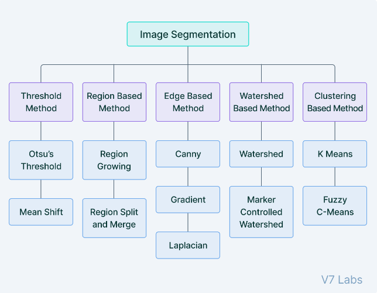
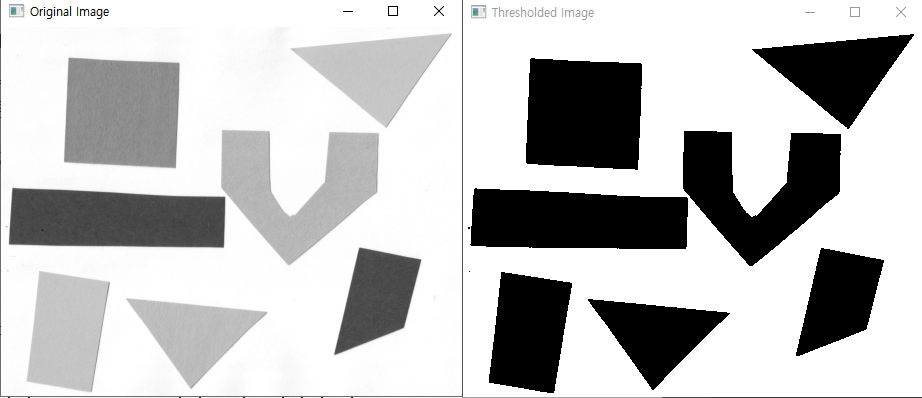
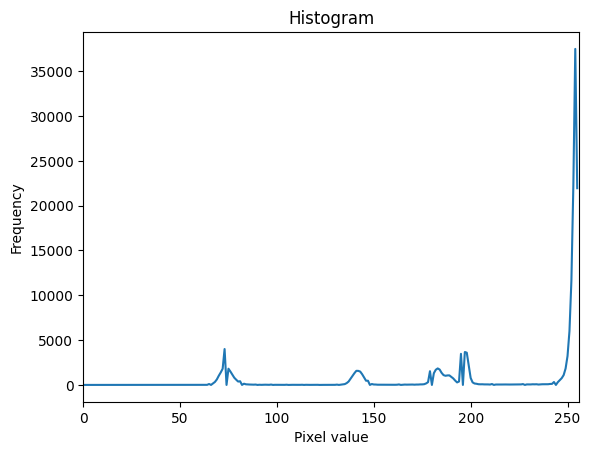

# Tradition Image Segmenation
* Image Segmentation : Object Detection처럼 사진 속 객체를 box가 아닌 정확한 영역으로 표시.
    * 특정 객체만 표시하는 것이 아닌 전체 이미지에 걸쳐 객체를 구분하여 각 객체의 영역을 그림.

  

[이미지 출처](https://www.jeremyjordan.me/semantic-segmentation/)   

- 이미지의 pixel들을 어떠한 객체에 속하는지 결정.
- RGB나 흑백 이미지를 입력으로 넣으면 Segmentation map이 나오게 됨.  
.png?raw=true)  
    [이미지 출처](https://www.jeremyjordan.me/semantic-segmentation/)


## 등장 배경.
1. Object Detection의 한계.
    * 객체의 정확한 위치, 크기, 모양 등을 파악할 때 bounding box로는 한계가 존재.
    * 자율 주행 및 로봇 비전과 같은 고수준의 이미지의 이해가 필요한 분야가 대두.
1. Image Segmentation은 pixel단의 분류 문제이므로, 많은 연산량을 필요로 하는데 GPU등 컴퓨팅 자원의 발전은 Image Segmentaion의 실용성을 높임.
2. 딥러닝의 등장.


## 활용 분야.
1. 자율 주행 및 로봇 비전
    * 도로 환경 인식, 장애물 감지, 주변 환경 이해.
2. 의료 영상 분석
    * 종양, 암 등 질병 부위 탐지 및 정량화, 해부학적 구조 구분
3. 원격 탐사 및 위성 영상 분석
    * 도시, 산림 지 등 지표면의 유형 구분, 재해 지역 파악
4. 산업 자동차 및 품질 검사
    * 표면의 스크래치, 크랙, 이물질과 같은 제품 결함 검출, 조립 라인에서 부품 인식 및 위치 파악
5. 패션 및 뷰티 산업
    * 가상 착용 및 메이크업 시뮬레이션, 신체 부위 및 의복 부위 분할.
* 위의 4가지 분야 말고도 정말 다양한 분야에서 활용되면서 발전 방향은 무긍무진하다.

## Segmnetation의 종류
.png?raw=true)   
- Semantic Segmetation
    - 의미론적인 분할로 instance를 구분, 같은 instance면 구분하지 않음.
- Instance Segmentation
    - 객체적인 분할로 이미지 객체를 구분해 분할(일종의 Semantic + Object detection)
- Panoptic Segmentation(2018)
    - 총괄적인 분할로 객체의 class와 instance를 구분하여 일종의 Semantic과 instance segmentation을 합쳐진 방식. 
    - labeling이 [Class][instance id]로 labeling이 되어 있음.
    - [논문 링크](https://arxiv.org/abs/1801.00868)

## Traditional Image Segmentation.

* 각 대표적인 적통적인 이미지 이진화 작업에 대해 알아보자
* Image Thresholding : 이미지 이진화
* Edge Detection : 윤곽 탐지

### Image Thresholding(이미지 이진화)
* 이미지 이진화는 image segmentation의 가장 간단한 방법으로 이미지 내의 물체와 배경은 0과 1로 픽셀값을 재설정하는 방법이다.

* 간단한 구현 코드
```python
import cv2
img = cv2.imread('./imgs/image-segmentation-4.png', 0) # grayscale로 이미지 읽어오기
thresh_val = 230
_, thresh = cv2.threshold(img, thresh_val, 255, 0)
# 원본과 변환값 확인
cv2.imshow('Original Image', img)
cv2.imshow('Thresholded Image', thresh)
cv2.waitKey(0)
cv2.destroyAllWindows()
```
* 결과 확인
  

* 기존에는 흐릿하게 보이는 객체들이 보다 더 선명하게 보이는 것을 확인할 수 있다.
* 하지만 실제로 위의 코드를 돌려보면 `thresh_val`에 따라 이미지의 결과가 엄청나게 달라지는 것을 알 수 있다.
* 따라서, Threshold의 적정값을 찾는 것은 매우 중요하다.
* 어떻게하면 이 Threshold의 적정값을 찾을 수 있을지 확인해보자

#### 실험적 방법
* 실험적 방법 적절한 Threshold를 찾는 가장 단순한 방법이다.
* Treshold의 값을 수동으로 조정하면서 결과를 관찰하는 방법

#### Analysis of Histogram
* 위에서 사용한 원본데이터를 기반으로 `cv2.calcHist()`를 통해 히스토그램을 그려보면 다음과 같다.  
  
* 중간에 튀는 지점이 있지만, 마지막에 부근에서 구분되는것을 확인할 수 있다.
* 이를 기반으로 `thresh_val = 220` 정도로 설정해서 보면 다음과 같다.
    
* 관련 코드
```python
# analaysis of histogram
import cv2
from matplotlib import pyplot as plt
img = cv2.imread('./imgs/image-segmentation-4.png', 0) # grayscale로 이미지 읽어오기

# 히스토그램 계산
hist = cv2.calcHist([img], [0], None, [256], [0, 256])

# 히스토그램 출력
plt.figure()
plt.title('Histogram')
plt.xlabel('Pixel value')
plt.ylabel('Frequency')
plt.plot(hist)
plt.xlim([0, 256])
plt.show()

# 히스토그램을 분석하여 적절한 Threshold 값 선택 
thresh_val = 220
_, thresh_img = cv2.threshold(img, thresh_val, 255, 0)

cv2.imshow('Original Image', img)
cv2.imshow('Thresholded Image', thresh_img)
cv2.waitKey(0)
cv2.destroyAllWindows()
```
#### algorithm of Otsu
#### adaptive Threshold
* adaptive Thresholding은 각 픽셀마다 임계값을 다르게 적용하는 것으로, 주변 pixel들의 Intensity 분포에 따라 threshold를 정한다.


### Edge Detection
* 이미지의 경계선을 찾아 객체의 윤곽을 추출하는 방법.

* 간단한 구현 코드
```python
# Experimental method
import cv2

img = cv2.imread('./imgs/image-segmentation-4.png', 0)
edges = cv2.Canny(img, 100, 200)
cv2.imshow('Edge Detection', edges)
cv2.waitKey(0)
cv2.destroyAllWindows()
```