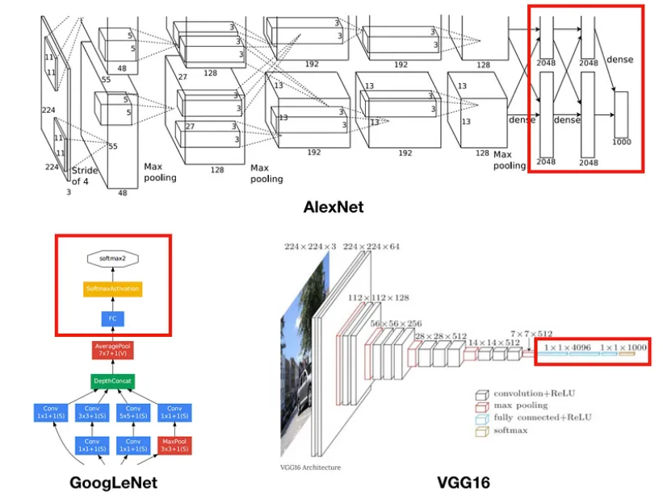

>  image segmentation에서 제대로된 Deep Learning을 활용한 논문.
[논문 링크](https://arxiv.org/pdf/1411.4038.pdf)

## FCN의 등장 배경
* FCN의 논문은 최초 개시는 2014년 11월으로, 2012년도에 AlexNet를 시작으로 Classification영역에서 딥러닝을 활용한 모델들의 등장으로 Vision 영역이 많은 관심과 연구가 진행되었다.
* Vision 영역 중 Object Dectection 영역에서도 [OverFeat](https://arxiv.org/pdf/1312.6229.pdf)과 [R-CNN](https://arxiv.org/pdf/1311.2524.pdf) (각 논문의 최초 개시는 2013년도 말)의 논문들이 발표되는 등 다양한 성과가 진행되었다.
* R-CNN같은 경우는 Semantic Segmentation에 대해서도 괜찮은 성능을 보여줬다.   
    

* R-CNN이 과연 DeepLearning일까? 
    * Fine-tuned AlexNet을 사용했다는 점에서 딥러닝일 수는 있으나 나머지 영역에선 전부 Traditional한 방법을 사용
    * SVM, Selective Search

* Image Segmentation에 딥러닝이 사용하기 시작한것은 2012년에 발표된 [Deep Neural Networks Segment Neuronal Membranes in Electron Microscopy Images](https://papers.nips.cc/paper_files/paper/2012/hash/459a4ddcb586f24efd9395aa7662bc7c-Abstract.html)를 시작으로 2013년에 발표된 [Learning Hierarchical Features for Scene Labeling](https://ieeexplore.ieee.org/document/6338939)도 존재한다.

## Abstract
* Convolutional Neural Network를 End to End와 pixels to piexls 방법으로 학습하여 semanctic segmentation 분야에서 SOTA 달성.
    * 초기 논문에서는 pixels to piexls가 아닌 `patch`기반으로 진행.
    * 초기 논문에서는 End to End를 사용하지 않아 CNN 출력에 대해 후처리(Conditional Random Field)를 통해 객체의 경계를 다듬는 과정이 필요됬음.
    * 초기 논문은 기본적으로 CNN을 분류기 즉 Classifier로 사용했지만, FCN에서는 분할기(divider)로 사용

* Skip Architecture

* 임의의 크기의 image를 넣어도 동일한 크기의 output의 나오도록 Fully convolutional network(FCN)를 구성.
    * 초기 논문에서는 임의의 크기가 아닌 단일 크기를 입력으로 사용
        * 이미지의 해상도(크기)가 달라지면, 모델이 정상적으로 작동하지 않음.

* 기존의 Classification Network를 transfer learning을 통해 fine-tuning 진행.
    * AlexNet, VGG16, GoogleNet 변형 2015년 당시의 가장 유명한 모델들.

## FCN(Fully Convolutional networks)
* 기존의 CNN에 관련 이해   
  
    [이미지출처](https://medium.com/@msmapark2/fcn-%EB%85%BC%EB%AC%B8-%EB%A6%AC%EB%B7%B0-fully-convolutional-networks-for-semantic-segmentation-81f016d76204)
    * Image classification의 모델들은 기본적으로 분류를 위해 Output Layer가 Fully-connected(FC)로 구성되어 있다.

### Adapting classifiers for dense prediction
* 하지만, FC layer는 Semantic Segmentation에서 단점으로 작동한다.
    * 이미지의 위치 정보가 사라짐.
        * 마지막에 한줄로 표현하기 때문에 n x n으로 유지되던 압축된 이미지들이 위치 정보가 없어지게 된다.
    * 입력 이미지의 크기가 고정된다.
        * 기본적으로 feature map이 크기가 고정되어 있으므로, 크기가 다른 입력이 들어오게 되면 작동하지 못한다.

* 논문에서는 위의 FC-layer의 한계를 보완하기 위해 모든 FC-layer를 Conv-layer로 대체함.
* Conv-layer로 변환시 1x1의 크기를 가지도록 함.   
    
    * 위 그림은 VGG16을 예시로 든 사진.

* FCN으로 변경하게 된다면, 비선형 함수를 사용하는 대신 비선형 필터를 사용한다.
* 어떤 크기의 입력에도 작동하며, 공간 정보를 담게 된다.
* 마지막의 Fully Convoultional 구조에서 마지막 레이어는 클래스 수에 대당하는 채널을 가진 feature map을 생성.
* 결과적으로 모든 layer에 Conv를 사용함으로서 groud truth를 각 layer의 출력을 얻을 수 있어 forward와 backward가 비교적 간단해져 효울적인 연산이 가능
    * Groud Truth : 모델 학습을 위해 사용되는 실제 픽셀 단위의 클래스 레이블로, 각 layer의 출력의 feature map에 해당되는 groud truth 레이블이 있어 모델의 예측과 비교하여 loss계산.

#### Receptive Field(수용 영역)의 중첩.
* 수용 영역은 output feature map의 한 픽셀이 입력 이미지의 어느 영역에 영향을 받는지를 나타냄.
* 수용 영역은 레이어가 깊어질수록, 입력 이미지의 정보가 중첩될수록 수용 영역은 점점 커짐.
* 특히 Segmenation에서는 픽셀 단위의 예측이 필요하므로, 각 픽셀이 이미지의 넓은 영역에 대한 고려가 필수적.
* 넓은 Receptive Field는 픽셀이 이미지의 전역적인 맥락을 이해하고, 주변 정볼를 활용하여 정확한 예측이 가능해짐.
* Fully Convolutional 구조를 통해 Receptive Field가 끝까지 확장.
    
#### 계산 효율성 증대.
* Patch 방식
    * 기존의 AlexNet을 가지고 Image Segmenation을 진행하게 된다면, 입력 이미지를 patch 단위로 나누고 이를 입력.
    * 각 패치에 대해 AlexNet으로 특징을 추출하고, softmax층을 통해 클래스 확률을 계산후 이미지 분할 맵 생성.
    * patch 단위이므로 patch 간의 관계나 전체 이미지의 맥락에 대한 이해도가 낮고, 계산량이 커 학습시 많은 시간이 걸린다.
    * 장점.
        * 반드시 이미지에는 필요없는 부분이 있다.
        * 강아지에 대한 feature를 추출해야하는데, 필요없는 배경까지 모두 출되는 경우.
        * patch를 통해 이미지의 필요한 부분만 뽑아내서 training 시킬 경우 Class imbalance 문제를 완화할 수 있다.(대부분이 배경인 문제.)

* FCN 방식은
    * 전체 이미지를 한번에 입력으로 받아 레이어 단위로 계산 수행.
    * Receptive Field가 겹치는 부분에 대한 중복 계산을 방지할 수 있음.
    * Patch 경계에서의 불연속성 문제도 해소 가능.
* Patch vs FCN  
  
* 위 그림을 보면 Patch 단위로 mini-batch로 sampling하여 학습하는것과 이미지 전체를 넣는 FCN의 학습 정확도는 별다른 차이는 없지만, 속도 측면에서 전체 이미지를 넣는 것이 더 빨라 논문에서는 이미지 전체를 넣는 방식을 채택함.

### Shift-and-stitch is filter rarefaction
* overfeat 논문에서 사용됬던 방법으로 coarse output에서 Dense predictions을 얻는 방법.
* 실제로 최종 output은 입력된 이미지에 비해 매우 크기가 작다.
* Pooling과 Stride를 이용해 보통 DownSampling(256x256 -> 128x128)를 조절한다.
    * DownSampling이 작게 될수록 Receptive Field의 크기가 작아 연산량이 많지만, 정보 손실은 적어 더 정밀한 정보를 얻을 수 있다.
    * 반대로 많이 될수록 정보 손실은 많아지지만, Receptive Field의 크기가 커져 연산량이 줄어든다.  
  
[이미지출처](https://stackoverflow.com/questions/40690951/how-does-shift-and-stitch-in-a-fully-convolutional-network-work)  
* 초기엔 저자들이 해당 방법을 사용했지만, 차후에 소개되는 Skip Architecture와 Upsamling방법을 사용.

### Upsampling is backwards strided convolution
* Upsampling을 통해 Dense map을 얻는 방법.
* Bilinear Interpolation  
    * 주어진 값들 사이의 값을 Linear하게 추정하는 방법.
    
  
[이미지출처](https://medium.com/@msmapark2/fcn-%EB%85%BC%EB%AC%B8-%EB%A6%AC%EB%B7%B0-fully-convolutional-networks-for-semantic-segmentation-81f016d76204)

* Deconvolution(or Backwards Convolution)
    * 일종의 Convolution의 역연산으로 입력을 받아 출력의 크기를 키우는 upsampling방법 중 하나.
      
    [이미지 출처](https://medium.com/@msmapark2/fcn-%EB%85%BC%EB%AC%B8-%EB%A6%AC%EB%B7%B0-fully-convolutional-networks-for-semantic-segmentation-81f016d76204)
    * 역연산 시 계산되는 weight들은 학습이 가능.

## Segmentation Architecture
* ILSVRC 분류기를 FCN로 변환.
* 기본적으로 Downsampling과 Upsampling을 진행하는 Encoder와 Decoder 구조로 되어있고, Downsampling에 사용하는 모델을 위의 ILSVRC모델을 사용햇다.
* 학습에는 multinomial logistic loss를 사용.(다중 분류 문제에 주로 사용되는 loss function)

### Combining
* PASCAL VOC의 데이터를 기반으로 FCN으로 변환하여 각각 AlexNet, VGG16, GoogLeNet을 학습 시킴.
  
* VGG16이 가장 뛰어난 성능을 보여줌.

* 현재까지의 구조  
  

* VGG16의 구조를 기반으로 구조를 구성했고, 위에서 설명했듯이 Down-smapling과 Up-sampling이 되는 구조이다.
* 위 구조에 대해 자세히 살펴보면 빨간색 Blaock이 maxpooling으로 정보 손실이 일어나는 단계로 총 5번 일어난다.
* 이렇게 maxpooling이 일어나게 되면 정보 손실이 발생하여 fine information이 부족하여 segmentation에 대해 좋은 성능을 보이긴 어렵다.
  
* 실제로 기본 모델과 결과를 확인해보면 정확하지 않다는 것을 볼 수 있다.

### Skip Architecture
* 위에서 결과를 확인하다 싶이 생각보다 Segmenatation에 대한 결과가 좋지 않다는 것을 볼 수 있다.
* 따라서 앞서 layer에 있는 정보를 가져오는 Skip Architecture를 구성한다.    

    
* 왜 Skip_architecture를 사용했을까?
    * [Visulizing and Understanding Convolutional Networks](https://arxiv.org/pdf/1311.2901.pdf)에서 얕은 층에서는 지역적인 feature를 깊은 층에선 global feature를 감지된다는 insight를 얻어 앞의 얕은 층에 대한 정보를 가져왔다.

* FCN-8의 구조를 보여주는 그림.  
     
[이미지 출처](https://www.researchgate.net/figure/Fully-convolutional-neural-network-architecture-FCN-8_fig1_327521314)    

## Result
* Image Segmentaion의 결과

  
  
* 실제로 이미지를 보면 32 -> 16 -> 8로 갈수록 즉, skip connection이 많이 사용될수록 더 뛰어난 선능을 보여주는것을 확인할 수 있다.

* SOTA 논문들과의 비교.  
  
    
    * 결과를 보면 정확도 측면에서도 뛰어나지만, 추론 속도도 많이 개선된 것을 알 수 있다.

## FCN 이후 등장 논문
* [U-Net](https://arxiv.org/abs/1505.04597)(2015)
* [SegNet](https://arxiv.org/abs/1511.00561)(2015~2016)
* [DeepLab](https://arxiv.org/abs/1412.7062)(2014~2016)

## 참고자료
* [FCN 논문](https://arxiv.org/pdf/1411.4038.pdf)
* [FCN 리뷰](https://medium.com/@msmapark2/fcn-%EB%85%BC%EB%AC%B8-%EB%A6%AC%EB%B7%B0-fully-convolutional-networks-for-semantic-segmentation-81f016d76204)

