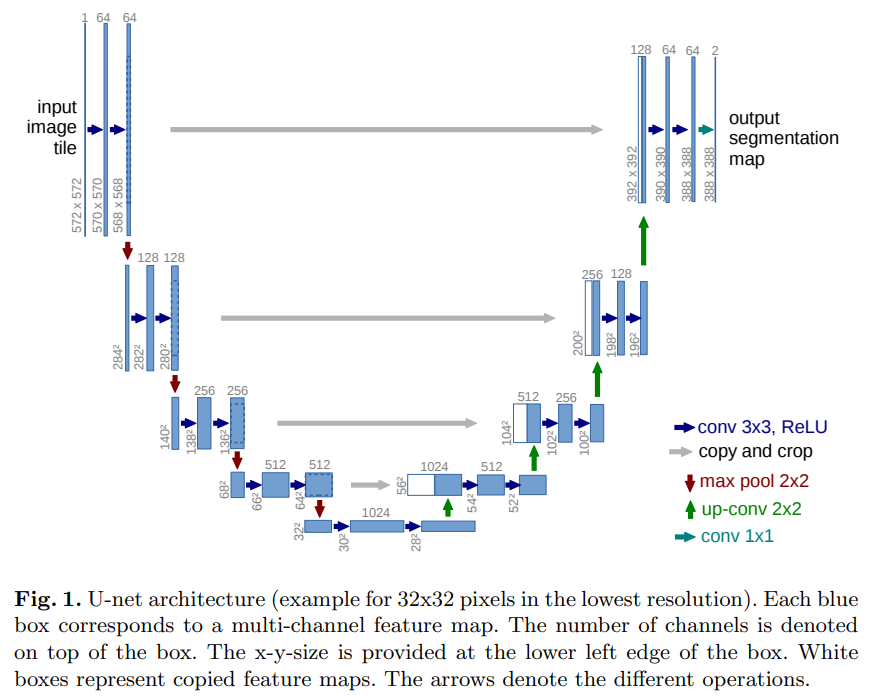
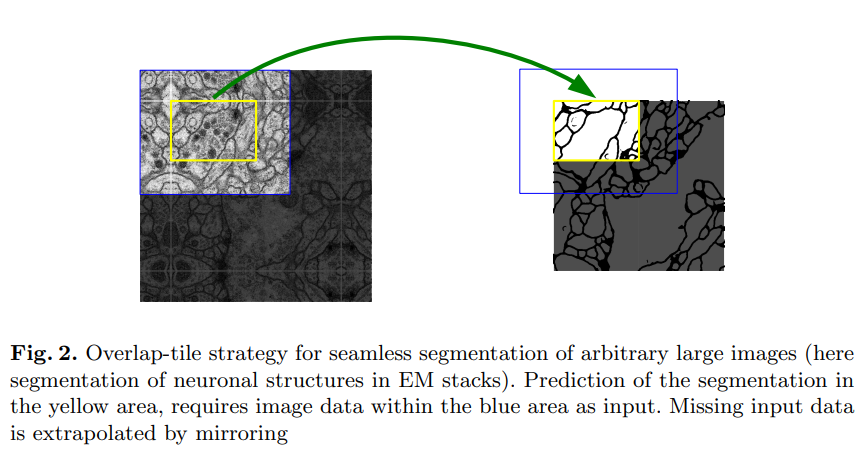
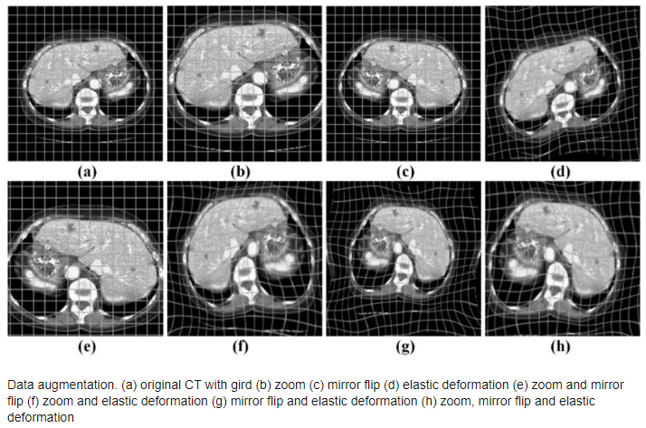
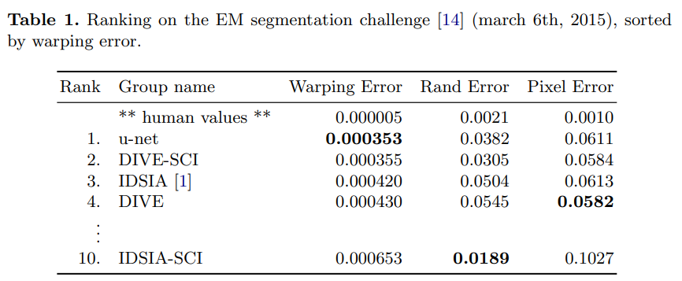
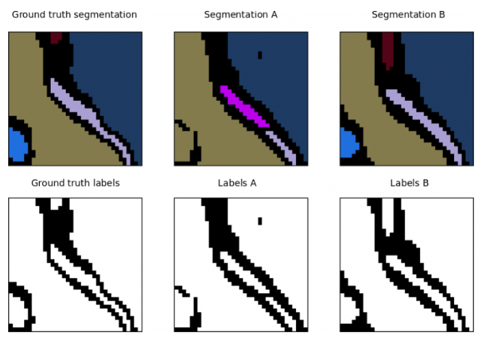
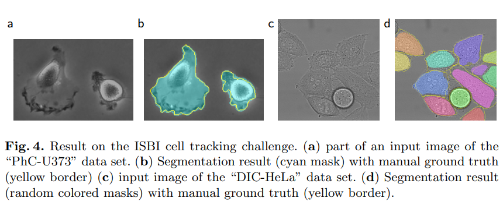
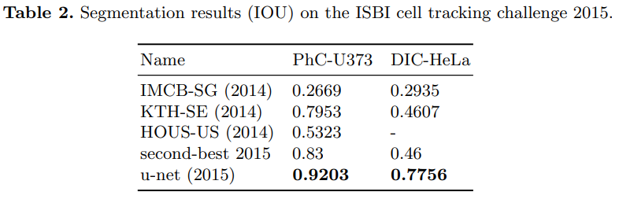

# [U-Net: Convolutional Networks for Biomedical Image Segmentation](https://arxiv.org/pdf/1505.04597)
* Image Segmentation을 위한 Convolutional Networks.
* 알파벳 U와 비슷한 형태라서 U-Net이라는 이름을 가짐.
* 데이터 양이 많지 않아도 충분히 좋은 성능을 얻을 수 있음.
* 또한 2015년도 당시 최신 GPU로 512x512 이미지 처리에 1초도 안걸림.

## Introduce
* [AlexNet](https://proceedings.neurips.cc/paper_files/paper/2012/file/c399862d3b9d6b76c8436e924a68c45b-Paper.pdf)이 2012년도에 등장하고 나서, 2015년도까지 더 크고 더 깊은 Networks가 등장하면서 Vision 분야에서 많은 발전이 있었다.
* 하지만, 이런 발전은 이미지의 Class를 단순 분류하는 Image Classification 영역에서만 이루어졌지 실제 생물의학과 같은 다양한 비전 분야에서는 픽셀 단위로 Localization이 요구된다.
* 학습을 위해 엄청나게 많은 이미지들이 요구되며, 수작업으로 픽셀단위로 라베링하는 거승 많은 시간과 비용이 요구된다.
* 이러한 배경에서 적은 양의 학습 데이터로도 정확한 이미지 분할이 가능한 Encoder-Decoder 기반의 구조를 설명함.

## Architecture

* 위에서 언급했듯이 Encoder-Decoder 기반의 구조로, Skip-Connection을 이용하여 더 정확한 위치 정보를 활용할 수 있다.
    * Fully convolutional network(FCN)을 기반으로 구조를 생성.
    * 압축하는 단계까지는 비슷하게 진행하고, 확장 Network를 압축 Network에서 MaxPooling layer만 Upsamlping layer로 교채한 단계.
        * 이런 방법은 해상도를 더 높일 수 있다.
    * FCN과 마찬가지로 Encoder 단계의 출력을 Decoder에 입력으로 사용하여, 더 정확한 결과를 도출할 수 있다.
* Encoder, Decoder 이후에 1X1 Convolution 연산을 통해 원하는 Classs로 수로 맵핑한다.
* 총 23개의 Convolution layer를 가지고 있다.

### Encoder
* 기본적으로 이미지가 입력으로 주어지면 이를 압축하는 역활을 함.
* Convolution으로 3x3이 2번, Maxpooling 2x2가 1번 작동하는 방식으로 이루어짐.
    * Convolution 3x3이 2번 이루어지면, 이게 같은 level의 Decoder의 입력으로 사용됨.
* 위의 이미지를 보면 30x30의 1024개 채널까지 압축함.
* 압축하면서 이미지의 크기는 줄어들지만, 채널 수는 증가함.
    * Maxpooling시 이미지의 크기가 절반으로 감소하고, 채널 수는 2배가 됨.

### Decoder 
* Decoder는 인코더를 통해 압축된 이미지를 다시 원래 이미지의 크기로 복원하는 역활.
* 특히, 채널 수까지 Encoder의 레벨의 맞게 복원을 함.
    * 채널의 수가 기존의 FCN(Classes가 채널 수로 PASCAL VOC의 경우 21개사용)보다 많기 때문에 인코더에서 추출된 풍부한 맥락 정보를 고해상도 영역으로 전달하여 더 정확한 Image Segmentation이 가능해진다.
* 이미지를 확장하면서 크기는 늘어나지만, 채널 수는 감소함.

### Overlap-tile strategy  
  
* 크기가 큰 image에 대해 Segmentation을 진행할 때, 이미지를 작은 타일(tile)로 나누어 처리하는데, 이 경우 타일 경계에서 Segmentation의 결과가 불연속적으로 나타나게 된다.
* 위의 문제를 해결하기 위해 나온 방법이 overlap-title strategy이다.
* 노란색 영역이 Segmentation이 이뤄질 영역이면, 주변 정보를 주기 위해 U-net에 파란색 영역을 입력으로 사용한다.
* 가장자리에 있는 영역일 경우에는 주변의 영역이 존재하지 않는데, 이는 존재하는 영역에 대해 이미지의 경계를 따라 대칭적으로 복사하여 **가상의 입력 데이터**를 사용하여 해결한다.(Image Mirroring)
* 이 기법은 GPU 메모리의 한계로 인해서 해상도가 제한될 수 있으므로 특히 크기가 큰 이미지를 사용할 때 중요하다.

## Traing
* U-net 학습시 특히 논문에서 Biomedical에 대해 Segmentation을 진행 시 사용 가능한 훈련 데이터가 많지 않기 때문에, excessive(과도한) data augmentation을 사용함.
    * Elastic deformation : 이미지를 비선형적으로 변형시켜 다양한 형태의 변화를 주는 기법.  
    
    * 회전 : 이미지를 임의의 각도로 회전시켜 다양한 방향의 샘플을 생성하는 기법.
    * 크기 조정 : 이미지의 크기를 임의로 변경하여 크기에 불변한 특징을 학습할 수 있도록 하는 기법.
    * Gray value variation : 이미지의 밝기나 대비를 임의로 변경하여, 조명 변화에 강건한 모델을 학습하는 기법.

* 기본적으로 End-to-End 방식으로 학습, 입력 이미지와 그에 해당하는 분할 레이블(Segmentation Label)을 쌍으로 사용하여, 네트워크 전체를 한 번에 학습함.
  * Caffe 프레임워크를 사용하여 Stochastic Gradient Descent(SGD)로 학습됨.
    * Momentum(0.99)로 설정해서 학습.
  * GPU 메모리를 효율적으로 사용하기 위해 큰 입력 타일을 사용하고, 배치 크기를 1로 설정.
  * Weight map을 사용해 특정 클래스의 픽셀(배경)이 차지하는 비율을 고려하여 불균형을 보정하고 경계부분을 더 잘 학습할도록 만듬.
  * Loss function으로 Pixel-wise Softmax와 Cross-Entropy 사용

## Results
1. 전자 현미경(electron microscopic) image Segmentation
  * 데이터 세트는 ISBI 2012에서 시작된 EM 분할 챌린지에서 제공되며, 연속 단면 전자 현미경 이미지 30세트(512x512 픽셀)로 구성되어 있습니다.  

* 사람이 작업한것보다는 좋지 않지만, 다른 모델들에 비해 매우 뛰어난 성능을 가지는 것을 보여준다.
* Error에 대한 의미
    * Warping Error : Segmentation의 형태학적 정확도를 측정하는 지표로 의료데이터에 특히 많이 사용된다. 각 픽셀에서 가장 가까운 객체 경계까지의 거리를 계산하여 Distance map을 얻어 Ground Truth와 예측된 Segmentation 결과 사이의 대응되는 픽셀을 찾고, 각 픽셀 쌍 사이의 거리를 평균하여 얻음. 낮은 수록 더 좋은 지표.  
    
    * Rand Error : Segmentation 결과의 일관성을 측정하는 지표로 낮을수록 좋음. 2개의 픽셀을 뽑아 동일한 객체에 속하는지 여부를 기준으로 계산.
    * Pixel Error : Segmentation의 결과를 픽셀 단위 정확도를 측정하는 지표. 픽셀 에러가 낮을수록 Ground Truth와 유사하다는 의미.
2. ISBI cell tracking challenge 2015.
* 첫번째 cell data에 대한 확인  
 
* 분할 결과   
  
  * IoU가 2등과 비교했을때 말도 안되게 차이가 날 정도로 U-net이 매우 뛰어나다는 것을 알 수 있다.

* 위의 모든 결과가 매우 적은 입력데이터 20~30개 정도만 사용했지만, Elastic deformation이라는 Data Augmentation을 통해 많은 학습데이터가 없더라도 뛰어난 성능을 가질 수 있다는 것을 보여줬다.
