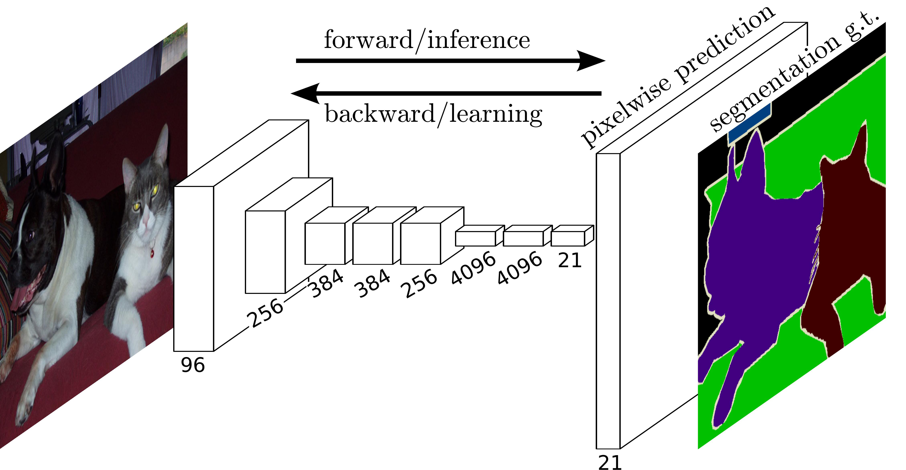

# [DeepLab V1](https://arxiv.org/pdf/1412.7062)
* DCNN(Deep Convolutional Neural Network)을 기반으로 한 Semantic Image Segmentation 모델.

## Introduction
* DCNN은 다양한 비전 영역에 대해서 뛰어난 성능을 보여줌.
* DCNN읜 한계
  * Signal Downsampling(신호 다운샘플링): 일반적으로 Pooling연산을 통해 Feature Map의 크기를 줄인다. 이는 해상도를 낮춰 픽셀 단위의 정확한 위치 정보를 잃게 되어 Semantic Segmentation의 정확성이 떨어짐.
  * Spatial Invariance(공간적 불변성): DCNN은 일반적으로 이미지의 전체의 특징을 잡는데 유리하여 분류와 같은 작업에서는 유용하지만, 픽셀단위의 분할과 같은 작업에서는 분리함. 특히 필터가 이미지의 위치에 따라 적용되지 않아, 객체의 위치와 모양 변화에 민감하지 않음.

* atrous convolution을 통해 Signal DownSampling 문제를 해결하고, Conditional Random Field(CRF)를 통해 Spatial Invariance 문제를 해결함.

## Related Work
* 기본적으로 Fully Convolutional Network(FCN)의 한계를 극복하고자 함.

### FCN 구조    

  * FCN의 구조를 보면 이미지를 Down-sampling을 진행하고 마지막에 Up-sampling을 수행하여 입력 이미지와 같은 크기의 Segmentation map을 출력.
  * 기본적으로 Down-sampling이 진행되고 이를 Up-sampling을 진행했기 때문에 경계선 정보와 같은 정보 손실이 발생.
  * FCN은 Downsampling과정이 3번 발생하므로 Latent vector에서는 1개의 픽셀이 8x8의 Receptive Field(수용 영역)를 가지지만 DeepLab은 이보다 더 큰 Receptive Field를 가져 더 큰 객체나 복잡한 장면에 대한 이해력이 높다.

### DeepLab architecture 
* FCN과 마찬가지로 VGG16을 기반으로 구조를 개선.  

* Hole 알고리즘
  * 필터 크기는 그대로 유지하고 입력의 간격(Atrous rate)을 2 또는 4로 주어 Receptive field를 넓힘(해상도는 그대로 유지)
    * 더 큰 문맥 정보를 캡쳐할 수 있도록 도와줌
    * 일반적인 Pooling이 없어도 더 밀집된 feature map을 생성.
    * Down_samping이 없으므로 정보 손실이 없어짐.

    
[이미지출처](https://towardsdatascience.com/witnessing-the-progression-in-semantic-segmentation-deeplab-series-from-v1-to-v3-4f1dd0899e6e)

## Results
